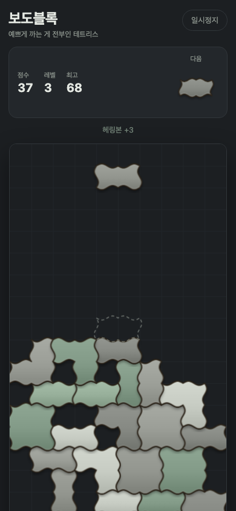

# 보도블록

**예쁘게 까는 게 전부인 테트리스.**

칸을 마구 채운다고 줄이 사라지지 않는다. 오직 예쁜 패턴으로 보도블록을 까는 게 목적인 게임이다.
빌드 도구 없는 순수 HTML/CSS/JS 한 페이지, Canvas 2D.



## 실행

```sh
python3 -m http.server 8123
# http://localhost:8123
```

ES 모듈을 쓰므로 `file://` 로는 열리지 않는다. 아무 정적 서버나 띄우면 된다.

## 조작

| | |
|---|---|
| 이동 | `←` `→` / 좌우 스와이프 |
| 회전 | `↑` `Z` `X` / 탭 |
| 소프트드롭 | `↓` / 아래로 짧게 스와이프 |
| 하드드롭 | `Space` / 아래로 길게 밀기 |
| 일시정지 | `P` / 우상단 버튼 |

모바일 세로 화면(390px 폭) 기준으로 맞췄고 데스크톱에서도 그대로 동작한다.

## 규칙

줄은 **사라지지 않는다.** 블록이 착지할 때마다 이웃과의 관계로 점수가 붙는다.

| 패턴 | 점수 | 판정 |
|---|---|---|
| 헤링본 | **+3** | 새 셀이 기존 셀과 서로 수직으로 맞물릴 때, 쌍마다 |
| 바구니짜기 | **+5** | 2×2 칸이 꽉 차고 가로 2 + 세로 2 조합일 때 |
| 완성 줄 | **+10** | 한 줄이 빈틈없이 채워질 때 (줄은 그대로 남는다) |
| 악센트 | **+4** | 밝은 회색 악센트 블록이 대각선으로 체스판처럼 이어질 때 |
| 구멍 | **−2** | 위가 막힌 빈 셀이 새로 생길 때마다 |
| 단조로움 | **−1** | 같은 방향이 3개 이상 나란히 이어진 구간 — 소폭 감점 |

꼭대기에 닿으면 끝. 깔린 바닥과 패턴 통계를 보여주고, PNG로 저장하거나 **자랑하기**로 게시판에 올릴 수 있다.
최고 점수와 닉네임은 `localStorage`에 남는다 (저장이 막힌 환경에서는 조용히 건너뛴다).

## 자랑하기 게시판

`board.html` — 상위 50(점수순) · 최근 20. 닉네임·점수·패턴 뱃지·미니 보드를 보여주고 내 기록은 강조된다.
각 카드에는 좋아요·댓글 수(♥N · 💬N)도 작게 붙는다. 미니 보드를 눌러 크게 보면(라이트박스) 좋아요를 누르고
댓글을 달 수 있다.

백엔드는 Vercel Function `api/brag.js` 하나, 저장소는 Upstash Redis (`KV_REST_API_URL`, `KV_REST_API_TOKEN`).

| | |
|---|---|
| `GET /api/brag?tab=top\|recent` | `{ ok, tab, items[] }` — 각 항목에 `likes`/`comments` 카운트 포함(파이프라인 1회, N+1 없음). `s-maxage=10, stale-while-revalidate=60` |
| `POST /api/brag` | `{ name, score, stats, board, placed, landed }` → `{ ok, id, rank, score }` |
| `GET /api/brag?action=comments&id=<id>` | 라이트박스가 열릴 때 한 번에: `{ ok, liked, likes, comments[] }` (최신순 최대 50). 없는 id 는 404 |
| `POST /api/brag?action=like&id=<id>` | 좋아요 토글 → `{ ok, liked, count }`. `X-Device-Id` 헤더 필요(없거나 형식 오류면 400), 없는 id 는 404 |
| `POST /api/brag?action=comment&id=<id>` | `{ name, text }` → `{ ok, comment, count }`(201). `X-Device-Id` 필요, 같은 (id, device) 는 10초에 1회(초과 429), 없는 id 는 404 |

점수는 클라이언트를 믿지 않는다. `placed`(조각 배치 기록)를 받아 `replay.js` 로 처음부터 다시 깔아
점수·통계·격자가 모두 일치할 때만 저장한다(불일치 400). 닉네임 2~12자·허용 문자만, 바디 32KB, IP당 분당 5회.

좋아요·댓글의 신원은 브라우저별 `deviceId`(UUID, `localStorage`에 저장, `X-Device-Id` 헤더로 전송)뿐이다.
서버는 형식(36자 UUID)만 검증하고 진짜 신원 증명으로는 쓰지 않는다. 댓글 이름 1~12자·내용 1~200자,
트림·제어문자 제거 후 서버에서도 재검증한다. 저장 시 deviceId 원문 대신 짧은 해시(앞 8자)만 남기고 삭제 기능은 없다.

Redis 키: `brag:top`(ZSET score→id) · `brag:recent`(LIST, 200개) · `brag:e:{id}`(JSON) · `brag:rl:{ip}`(제출 rate limit) ·
`brag:likes:{id}`(SET, deviceId) · `brag:comments:{id}`(LIST, 최대 200개 LTRIM, 오래된 것부터 밀려나고 삭제되진 않는다) ·
`brag:crl:{id}:{deviceId}`(댓글 rate limit, SET NX EX 10초).

로컬에서 API까지 띄우려면 `.env.local` 을 둔 채 `vercel dev` (실제 Redis에 기록되니 주의).

## 조각

- **I형** — 2×1 도미노. 가로/세로 회전. 가장 흔하다.
- **L형** — I형 두 장이 직각으로 맞물린 3셀 조각.
- **판석** — 2×2 큰 정사각 판석.

충돌 판정은 셀 단위 직사각이고, 톱니(인터로킹) 실루엣은 **렌더링에서만** 그린다.
윤곽선의 물결은 격자 절대좌표로 계산해서 이웃 조각과 정확히 맞물리며,
조각 모양은 오프스크린 캔버스에 캐시한다.

## 파일

| 파일 | 역할 |
|---|---|
| `index.html` | 화면 구조 |
| `style.css` | 다크 테마 UI |
| `pattern.js` | 패턴 판정 — 순수 함수만, DOM 의존 없음 |
| `shapes.js` | 조각 정의, 회전, 외곽선 추출 |
| `render.js` | 물결 실루엣 그리기, 스프라이트 캐시, 팔레트 |
| `input.js` | 키보드 / 터치 입력 |
| `game.js` | 게임 루프, 상태, HUD, 이미지 저장 |
| `replay.js` | 배치 기록으로 게임 재계산 — 클라이언트 채점과 서버 검증이 공유 |
| `brag.js` | 종료 오버레이의 자랑하기 폼, 닉네임·내 기록 id·`deviceId` 기억 |
| `brag-validate.js` | 제출·좋아요·댓글 검증(닉네임·형식·재계산 대조), 직렬화 — 순수 함수, Node 의존 없음(브라우저도 씀) |
| `brag-store.js` | Redis 키 구조와 목록·저장·좋아요·댓글·rate limit (Node 전용, `hashDeviceId` 포함) |
| `brag-handler.js` | `/api/brag` 요청 처리 — 제출/목록/좋아요/댓글 라우팅 (redis 주입 가능) |
| `brag-format.js` | 상대 시각, 스탯 뱃지 |
| `brag-social.js` | 좋아요·댓글 API 클라이언트 — `board.js` 라이트박스가 사용 |
| `api/brag.js` | Vercel Function 진입점 |
| `board.html` / `board.js` | 게시판 화면, 미니 보드는 `render.js` 스프라이트 재사용, 라이트박스에 좋아요·댓글 |

## 테스트

```sh
node --test
```

`pattern.js` 의 판정 규칙(헤링본·바구니짜기·구멍·완성 줄·단조·악센트·합산) 8개, 라이트박스 레이아웃 5개,
자랑하기(재계산 대조·닉네임·저장소·핸들러·포맷) + 좋아요·댓글(검증·토글·LTRIM·rate limit·목록 카운트) 28개,
총 43개 테스트. 핸들러는 가짜 Redis 로 직접 호출한다.

---

원안: [studio.whynot](https://www.threads.net/) — "보도블록을 까는 컨셉의 테트리스 게임"
